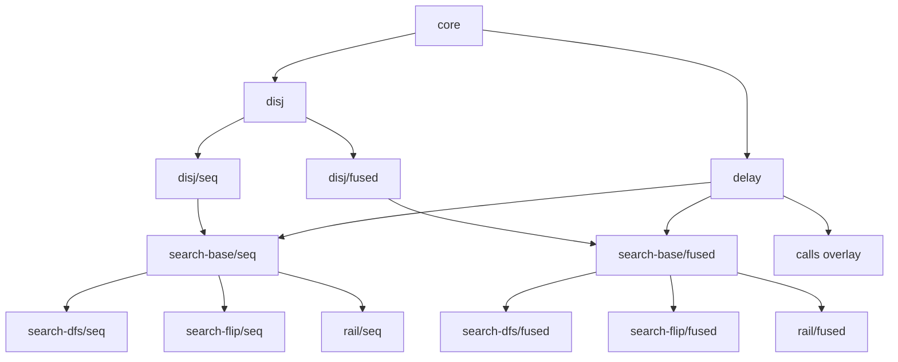

# Semantics Organization

This is the primary repo-level overview of the active semantics story.

This repo now has one active semantics stack:

- the feature-based search lattice under `racket-server/src/search-lattice`

The app/API boundary runs through that lattice directly.

Related notes:

- `racket-server/src/search-lattice/SEMILATTICE.md`
  - lower-lattice runtime/context details
- `racket-server/src/search-lattice/PICTURE-DESIGN-NOTES.md`
  - picture-specific design judgments and open choices
- `racket-server/derivations/refocusing/NOTES.md`
  - separate derivational experiment, not the active runtime

## Search Lattice

The internal stepper family is organized by features instead of numbered levels:

- `core`
- `delay`
- `disj`
- `search-base`
- `search-dfs`
- `search-flip`
- `rail`
- `calls` as an overlay

The important split is that the search lattice is call-free until the `calls`
overlay is added.

## Hoist Axis

The key semantic axis added by the internal lattice is hoisting:

- `seq` means early hoist / staged contexts
  - pending conjunction is distributed across visible disjunction promptly
  - runtime contexts use `K` plus `KDisj`
- `fused` means late hoist / mixed contexts
  - mixed `conj/disj` shapes can remain stable longer
  - runtime contexts extend `K` directly

This hoist question is separate from scheduler policy:

- `dfs`
- `flip`
- `rail`

and separate from source compilation choices such as delay placement.

## Why The App Uses The Search Lattice

The GUI/API boundary now uses structured strategy selection:

- `sourceMode`
- optional `compileProfile` for `mini`
- `searchStrategy = { hoist, scheduler }`

The app flow is:

1. parse/transpile surface input to canonical `canonical/config`
2. validate that canonical target
3. run relation-aware internal `wf`
4. step using the reducer selected by `searchStrategy`

The app/runtime seam lives in:

- `racket-server/src/search-strategy.rkt`
- `racket-server/src/search-runtime.rkt`

## Stable Conclusions Worth Carrying

- The early-vs-late hoist question already appears at the plain
  conjunction/disjunction layer. It is not fundamentally about relation calls.
- Delay/suspension and scheduler policy are separate axes from hoisting.
- The internal search lattice makes those axes explicit without surfacing every
  intermediate machine in the GUI.
- Relation calls are better understood as an overlay on delayed search, not as
  part of the core search lattice itself.
