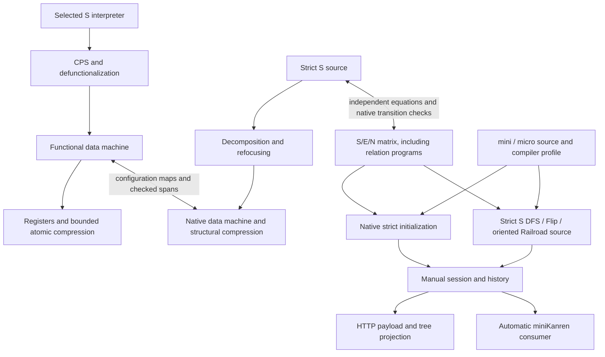

# Semantics and application organization

The selected account is the [S reference, Search/rail](../racket-server/derivations/s-reference/README.md).
Its functional and syntactic derivations meet through explicit configuration
maps and prescribed transition spans. The [native S/E/N matrix](../racket-server/derivations/matrix/README.md)
uses the same factoring, including a full relation-program extension. The
Strict Search view executes that matrix's S reduction relation directly.
The GUI defaults to strict Railroad. No Interleave, Flip-Flop and Railroad
now use the matrix's [strict S scheduler extension](../racket-server/derivations/matrix/scheduler-source.rkt).
Flip reuses the selected strict source itself; Railroad has an explicit
orientation map with configuration-level transition checks.

The [research inventory](../racket-server/derivations/README.md)
owns the detailed artifacts and proof obligations. The
[correction log](../racket-server/derivations/CORRECTIONS.md)
records the earlier strictness, scope, and commitment mistakes.

The filesystem separates roles: `racket-server/src/` compiles, runs, presents,
and serves selected semantics; `racket-server/derivations/` defines the current
strict semantics and machines. Complete alternative accounts live under
[`derivations/experiments/`](../racket-server/derivations/experiments/README.md),
including their source-specific and strict-comparison tests. Central
`racket-server/tests/` owns application and cross-account integration gates.

## Independent choices

| Choice | Coordinates | What it changes |
| --- | --- | --- |
| Compilation profile | Conjunction left/right × disjunction left/right × delay placement relbody/relcall/disj | Twelve ways to associate the source goals and insert explicit suspensions |
| Runtime view | Strict scheduler lattice / Strict reference (Flip) | Choose a scheduler or inspect the existing reference; both use strict matrix configurations |
| Lattice scheduler | No Interleave / Flip-Flop / Railroad | Retain priority, exchange operands, or retain orientation after Delay; operand maturation remains strict |
| Allocation representation | S / E / N | Introductions on syntax / ordered state support / numeric state supply |
| Call-free feature | Core / Delay / Disjunction / Search/rail | Four goal and computation languages, giving twelve S/E/N feature cells |
| Full relation language | Search/rail plus relations in S / E / N | Three additional cells with definitions and recursive calls |
| Derivation stage | R / D / Z / M / B / Big; functional machine and registers | How the same operations and pending work are represented |

The twelve compiler profiles are not the twelve representation/feature cells.
All GUI choices use full S source reductions. E/N are native research representations
connected by structural maps, not GUI allocation selectors.
Strict Search/rail has an explicit `mplus-delay` interaction; it is not merely
the literal union of the Delay and Disjunction rule sets.
The historical strict “Search/rail” name does not denote the oriented
Railroad scheduler. Current DFS/Flip use `mplus`; Railroad adds `mplusR`
and eager `YieldR`. The earlier dormant-branch semantics use `DisjL`/`DisjR`
and remain comparisons.

## The computation being represented

All choices share compiled goals, relation definitions, source IDs,
query metadata, and the strict initialization:

```text
(program Γ (commit (eval (Owners) query-goal initial-state)))
Γ = ((r:name (x:parameter ...) body) ...)
query-info = surface names, runtime variable identities, source tag, requested limit
```

Within strict `(program Γ q)`, q is the current computation or observation.
For the S reference account:

```text
Search   ::= Empty(O) | One(O,σ) | Yield(O,A,Search) | Delay(O,c)
A        ::= Answer(O,σ)
Frontier ::= Done(O) | Solo(O,σ) | Emit(O,A,Frontier)
           | Forced(O,Frontier) | More(Delay(O,c))
```

`eval`, `mplus`, `bind`, and `force` make the pending work explicit. Both
`mplus` operands mature left-to-right before merging; `Yield` tails and bind's
head and residual work are eager. Only `Delay` suspends computation. Search
candidates can still have pending bind obligations. `commit` matures its
operand and builds settled Frontier output; it does not force a Delay.

A Frontier ending in `More(Delay(...))` is a paused normal form. `advance`
preserves its committed prefix and crosses one exposed Delay. `Done` and
`Solo` are completed normal forms. Internal `force` and public `advance` are
separate operations, and host dispatch/trampolining does not create an
object-language Delay.

Terminal success is a single `Solo(O,σ)` node, with its own introductions and
state. The separate `Answer(O,σ)` payload is needed for `Yield`/`Emit` heads,
whose private scope differs from the common scope shared with the residual.

S retains ordered tagged Owner groups around active computations. Common
groups scope both branches or the answer and residual; answer-private groups
stay with that answer. Allocation uses the active path's introductions,
including unused and sparse ancestry. E/N carry the corresponding world in
their native states. Internal S force retains the removed Delay's Owners on
its active body; E/N enter the body with their state-local supply.

All calls expand through `eval-call`, without inserting a Delay. The program or compiler
profile determines suspension. In the strict derivation, Γ remains
explicit in source programs, syntactic program frames, and functional
`ProgramGoal`/`KProgram` data; recursive Big premises carry that environment too.

Source IDs identify occurrences before compiler lowering. Reassociation and
inserted delays preserve those origins: binary disjunctions generated from
one `conde` refer to its source span, while two identical calls at different
source locations retain different IDs. Runtime copies of one relation body
reuse that body's source IDs. The compiler consumes its occurrence map;
machine configurations carry the resulting labels directly.

## Derivation and application connections


```mermaid
flowchart TD
  I["Selected S interpreter"] --> CPS["CPS and defunctionalization"]
  CPS --> FM["Functional data machine"]
  FM --> REG["Registers and bounded atomic compression"]
  R["Strict S source"] --> D["Decomposition and refocusing"]
  D --> M["Native data machine and structural compression"]
  FM <-->|"configuration maps and checked spans"| M
  R <-->|"independent equations and native transition checks"| MAT["S/E/N matrix, including relation programs"]
  SRC["mini / micro source and compiler profile"] --> FULL["Native strict initialization"]
  MAT --> FULL
  MAT --> LR["Strict S DFS / Flip / oriented Railroad source"]
  SRC --> LR
  FULL --> SESSION["Manual session and history"]
  LR --> SESSION
  SESSION --> GUI["HTTP payload and tree projection"]
  SESSION --> RUN["Automatic miniKanren consumer"]
```

| Module | Responsibility |
| --- | --- |
| [transpiler/](../racket-server/src/transpiler/) | Parse mini/micro, associate goals, insert profile-selected delays, retain source IDs, initialize the selected native syntax and query metadata |
| [dormant-branch-semantics/](../racket-server/derivations/experiments/dormant-branch-semantics/README.md) | Earlier source semantics/WF, interpreter-machine derivation, and comparison evidence; no current GUI dispatch |
| [matrix/full-source.rkt](../racket-server/derivations/matrix/full-source.rkt) | Actual full S/E/N reduction relations and explicit call expansion |
| [matrix/scheduler-source.rkt](../racket-server/derivations/matrix/scheduler-source.rkt) | Strict S scheduler variations and native orientation syntax, reusing the matrix control equations |
| [search-runtime.rkt](../racket-server/src/search-runtime.rkt) | Select strict scheduler relations and WF; expose structural status and public boundaries |
| [program-runner.rkt](../racket-server/src/program-runner.rkt) | Manual sessions, one-step execution, exact configuration history, back/reset, query metadata |
| [app.rkt](../racket-server/src/app.rkt) | HTTP initialization, stepping, history and source-conversion endpoints |
| [search-picture.rkt](../racket-server/src/search-picture.rkt) | Project strict scheduler configurations and extract answers only along the committed Frontier |
| [search-picture-common.rkt](../racket-server/src/search-picture-common.rkt) | Shared logical-state, Owner and goal drawing; experimental control inspection stays in the experiment |
| [minikanren.rkt](../racket-server/src/minikanren.rkt) | Automatic answer consumption, run/run*, host-facing library and evaluator entry points |

The GUI preserves `running`, `paused`, `complete`, and `stuck` distinctions.
Stepping any paused Frontier records an explicit public `advance`
invocation before its source contractions. Internal `force-delay` remains a
reduction. Histories store their actual source terms. Manual GUI/session stepping ignores `run n`'s
requested answer limit. Automatic consumption belongs to `minikanren.rkt`:
it stops at an exposed Delay or terminal Frontier and returns the requested prefix while
retaining the whole saved Frontier. In the strict model this finishes the
current eager round and commitment. A zero limit can return without stepping.

The GUI defaults to Strict scheduler lattice and explicitly requests `rail`. Its
separate Strict reference (Flip) selection sends `{ "model": "strict" }` and hides the
scheduler controls while remembering the lattice choice. API and library
calls that omit a selection default to `(strict-search)`; an explicit
`(search-strategy "rail")` selects strict oriented Railroad. The runtime and
compilation settings remain independent. See the
[policy boundary](semantic-policy-matrix.md).

## Evidence and remaining work

The pre-relocation GUI check on 2026-09-07 used fresh native servers with the
strict scheduler correction. This recorded evidence concerns those semantics;
the current relocation gates are tracked in the test lanes. This microKanren
source completed in all four selections:

```racket
(run* (q)
  (disj (Zzz (== q 'A))
        (disj (== q 'B) (Zzz (== q 'C)))))
```

| Runtime | Steps | First answer inspected | Observed control |
| --- | --- | --- | --- |
| Strict Railroad | 26 | `B` | Paused at 9/17; public `advance` at 10/18; internal force at 12/22 |
| Strict Flip-Flop | 26 | `B` | Same boundary counts, with left-oriented merge constructors |
| Strict No Interleave | 24 | `A` | Two committed answers at the second pause, versus one in Flip/Rail |
| Strict reference (Flip) | 26 | — | Exact visible operation/status/count trace matched Flip-Flop |

All four runs finished with three committed answers.
Railroad's right-facing arrow remained visible while the highlighted operand
was the left resumption; its already-mature right branch remained a candidate.

A separate two-answer disjunction showed both `eval-atom` steps and
`mplus-one` with zero committed answers, then `commit-yield` and `commit-one`.
Back/Step replay restored the displayed operation and answer count, and reset
restored editing controls. Runtime and compiler controls froze during runs.

The mini `same` relation example, with conjunction right-associated,
disjunction left-associated, and Delay at every relation call, completed in
Railroad in 47 steps with four answers; inspecting the first showed `dog`.
Browser error/warning logs were empty. Native servers ran on loopback ports
5101/5174; no existing application server was replaced.

API integration additionally checks 36 compiler-profile/scheduler
combinations, exact payload/history replay, eager bind, divergence, scope and
explicit public advance. Railroad steps are compared to the strict reference
under orientation erasure; no strict-to-online fusion is used.

Checks compare native configurations, named edges, prescribed administrative
spans, intermediate Frontiers, actual work order, and exact allocation scope.
The full S functional route includes explicit relation environments through
its generated machine, registers, and existing compression. E/N functional
interpreters and register programs have not been separately derived.

The matrix has independent finite Big equations and certificate maps. Finite
checks do not establish universal adequacy, preservation, machine
correspondence, or productive-stream theorems. Further compression to a
`κ / Q / π` machine remains an investigation, not the implemented target.
The [test lanes](../racket-server/tests/TEST-LANES.md) identify executable gates
and the latest completed validation. The headless gate invokes the current
strict aggregate, the separate experiments aggregate, and application suites.
Dormant source laws and strict/dormant comparisons belong to the experiment;
live strict scheduler integration stays central. Separate E/N DFS/Railroad rows, downstream scheduler
derivations and universal correspondence proofs remain open.
