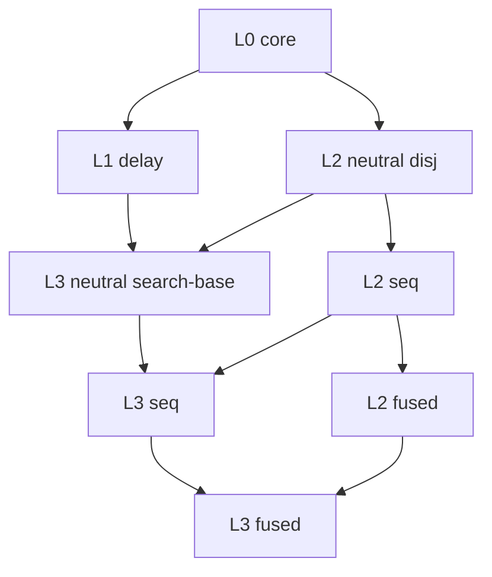
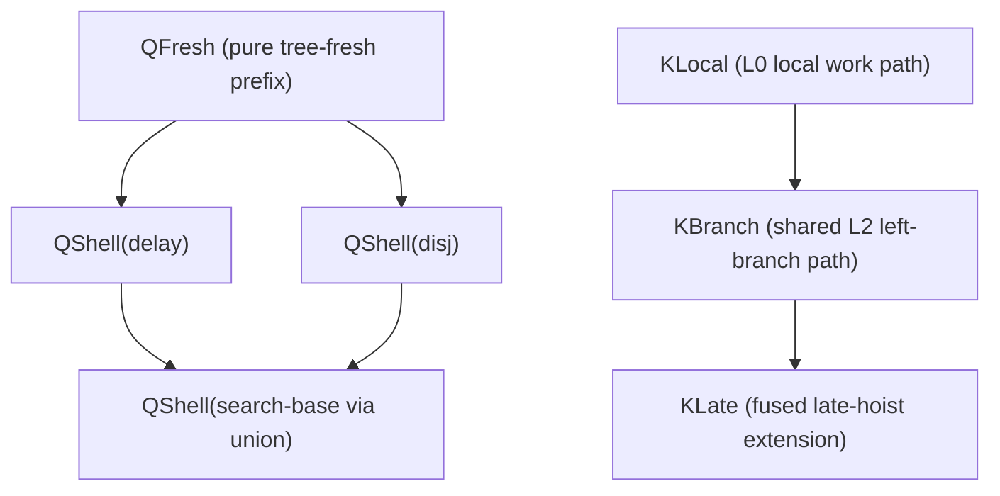

# L0-L3 Semilattice And Context Overlay

This note separates two different structures:

- the runtime language semilattice
- the context/decomposition overlay used by the reducers

Those are related, but they are not the same thing.

## Runtime Lattice



Main meet/join claims:

- `glb(delay, disj) = core`
- `lub(delay, disj) = search-base`
- `lub(delay, disj-seq) = search-base-seq`
- `lub(delay, disj-fused) = search-base-fused`

`rail`, `calls`, and strategy layers are follow-on extensions. They are not part
of this primary L0-L3 lattice.

## No-Freshening Core Model

Before layering variable-scope bookkeeping back in, the lower lattice has one
clean shared runtime story:

```text
L0/core
tail0 ::= cell
        | empty
        | (g σ)
        | (tail0 × g)

L1/delay extends L0
cfg1  ::= tail1
        | Bounced cfg1

tail1 ::= tail0
        | delay(work)

L2 neutral disj extends L0
cfg2  ::= tail2
        | answer + cfg2

tail2 ::= tail0
        | (tail2 <-+ tail2)

answer ::= cell

L3/search-base = join(L1, L2 neutral disj)
cfg3  ::= tail3
        | Bounced cfg3
        | answer + cfg3

tail3 ::= tail0
        | delay(work)
        | (tail3 <-+ tail3)
```

At this level:

- `Bounced` is committed delay shell
- `+` is committed answer shell
- the remaining `tail` is the one active-or-final tail under that shell

The key point is that `L2 neutral disj` extends `L0`, not `L1`. The `L3`
search-base layer is the runtime join of delay and neutral disjunction.

## No-Freshening Context Model

Ignoring freshening, the core local path already belongs to `L0`:

```text
Local ::= hole
        | (Local × g)
```

This is the path to the currently active local core work.

For late hoist, the active path needs to follow both conjunction and leftward
disjunction:

```text
Late ::= hole
       | (Late × g)
       | (Late <-+ tail)
```

After the freshening layer is restored, the shared context grammar carries both
the smaller left-branch helper and the larger late-strength helper. Seq and
fused then diverge in their reducers, not by using separate context languages.

For seq/eager hoist, we intentionally keep the same underlying runtime grammar
and make the policy difference live in the contexts and reduction relation, not
in a seq-specific runtime constructor.

## Scope Overlay

Once the no-freshening story is fixed, scope is best viewed as a lifting layer
over that bare skeleton, not as a second semantic redesign.

The runtime split is:

```text
terminal-search ::= cell
                  | empty

runnable-root ::= (g σ)
                | (search × g)

search ::= terminal-search
         | runnable-root
         | delay(runnable-search)
         | (search <-+ search)
         | FreshenedTree(c, search)

runnable-search ::= runnable-root
                  | FreshenedTree(c, runnable-search)

cfg ::= search
      | FreshenedShell(c, cfg)
      | Bounced cfg
      | promoted + cfg

promoted ::= cell
           | FreshenedTree(c, promoted)
```

Operationally, a reduction focuses on the same no-freshening skeleton as
before. The only extra question is what to do with the maximal immediate scope
prefix attached to the focused subterm.

There are only three cases:

1. Preserve
   - ordinary local work keeps the same `FreshenedTree*` prefix
   - example:
     `FreshenedTree*(g σ) -> FreshenedTree*(...)`

2. Carry
   - L0 conjunction handoff moves the innermost `FreshenedTree*` prefix from a
     resolved left result onto the right-hand continuation
   - example:
     `(FreshenedTree*(⊤ σ) × g) -> FreshenedTree*(g σ)`

3. Reclassify
   - crossing from unfinished tree into committed shell converts the
     enclosing frontier prefix into `FreshenedShell*`
   - examples:
     - final tail:
       `FreshenedTree* atom -> FreshenedShell* atom`
     - delay commit:
       `FreshenedTree*(delay work) -> FreshenedShell*(Bounced work)`
     - disjunction promotion:
       outer frontier scope shellifies, but the promoted payload stays
       `FreshenedTree* cell` on the left of `+`

This is why two freshening roles are enough:

- `FreshenedTree` marks scope attached to tree-side payloads, including
  promoted payloads on the left of `+`
- `FreshenedShell` marks scope attached to the enclosing shell/frontier
  structure

The important correction is that every recursive search child position is
itself a full `search` position. So freshened tree prefixes can reappear at
each subtree boundary, not just at the root of the whole search.

For example, a shape like

```text
FreshenedTree(c0,
  (FreshenedTree(c1,
     (FreshenedTree(c2, (a σ)) <-+ (b σ)))
   × h))
```

is exactly the intended kind of nested scoped search:

- `c0` scopes the whole conjunction subtree
- `c1` scopes the left conjunct subtree
- `c2` scopes the left branch inside the disjunction

So the right mental model is not "one prefix on the whole tree". It is
"every search node may be preceded by a finite `FreshenedTree*` prefix".

We do not need a third freshening role for `promoted`. The constructor
`promoted` already carries the "committed answer payload" distinction.

### Representative Lifted Traces

L0 scoped conjunction handoff:

```text
(FreshenedTree(c1, ⊤σ) × g)
-> FreshenedTree(c1, gσ)
```

L1 delay commitment:

```text
FreshenedTree(c1, delay(work))
-> FreshenedShell(c1, Bounced(work))
```

L2 answer promotion:

```text
FreshenedTree(c1, ⊤σ) <-+ right
-> FreshenedTree(c1, ⊤σ) + right
```

The policy split does not change those prefix actions. Seq and fused differ
only in where they focus inside the unfinished tail, not in how
`FreshenedTree*` and `FreshenedShell*` move once the focal redex is chosen.

### Scoped Seq Versus Fused Witnesses

Seq/eager hoist on an exposed boundary preserves the left branch's
`FreshenedTree*` prefix but hoists immediately:

```text
((FreshenedTree(c1, (a σ)) <-+ (b σ)) × h)
-> ((FreshenedTree(c1, (a σ)) × h) <-+ ((b σ) × h))
```

Fused/late hoist keeps descending into the left branch under that same exposed
boundary, still preserving the left branch's `FreshenedTree*` prefix:

```text
((FreshenedTree(c1, ((a1 ∧ a2) σ)) <-+ (b σ)) × h)
-> ((FreshenedTree(c1, ((a1 σ) × a2)) <-+ (b σ)) × h)
```

Then, once the left branch resolves, fused uses the same L0 carry action as
before:

```text
((FreshenedTree(c1, ⊤σ1) <-+ (b σ)) × h)
-> (FreshenedTree(c1, hσ1) <-+ ((b σ) × h))
```

So the scoped late-only witness is:

```text
((FreshenedTree(c1, ((a1 σ) × a2)) <-+ (b σ)) × h)
```

Fused may reach that shape. Seq may not, because seq must hoist as soon as the
outer `((alpha <-+ beta) × gamma)` boundary is exposed.

### Full Scoped Source-To-Runtime Traces

Take one scoped source program:

```text
((fresh(x, a1 ∧ a2) ∨ b) ∧ h) σ0
```

The common prefix of the seq and fused traces is:

```text
((fresh(x, a1 ∧ a2) ∨ b) ∧ h) σ0
-> (((fresh(x, a1 ∧ a2) ∨ b) σ0) × h)
-> (((fresh(x, a1 ∧ a2) σ0) <-+ (b σ0)) × h)
-> ((FreshenedTree(c1, ((a1 ∧ a2) σ1)) <-+ (b σ0)) × h)
```

Here `c1` is the scope bundle introduced by `fresh`, and `σ1` is the state
after substitution.

Seq diverges immediately at the exposed branch/conjunction boundary:

```text
((FreshenedTree(c1, ((a1 ∧ a2) σ1)) <-+ (b σ0)) × h)
-> ((FreshenedTree(c1, ((a1 ∧ a2) σ1)) × h) <-+ ((b σ0) × h))
-> ((FreshenedTree(c1, ((a1 σ1) × a2)) × h) <-+ ((b σ0) × h))
```

So seq hoists first, and only then continues local work under the preserved
`FreshenedTree(c1, ...)` prefix.

Fused diverges by descending into the left branch before hoisting:

```text
((FreshenedTree(c1, ((a1 ∧ a2) σ1)) <-+ (b σ0)) × h)
-> ((FreshenedTree(c1, ((a1 σ1) × a2)) <-+ (b σ0)) × h)
```

If the left branch continues to success, fused eventually reuses the same L0
carry rule under that preserved scope prefix:

```text
((FreshenedTree(c1, (⊤σ2)) <-+ (b σ0)) × h)
-> (FreshenedTree(c1, hσ2) <-+ ((b σ0) × h))
```

So the policy split is:

- seq changes the tree shape first, then keeps stepping under the same tree
  prefix
- fused keeps the tree shape longer, steps under the same tree prefix, and
  only later continues the surrounding conjunction

## Context Overlay



This is a reuse graph inside the shared context grammar, not a second
semilattice.

- machine criterion:
  prefer the decomposition that still looks like a clean pre-image for
  refocusing + fusion, so the runtime grammar stays broad and the scoped phase
  story is expressed through `QFresh` rather than through per-node scoped
  runtime families
- `QFresh` is the pure `FreshenedTree*` helper used for scoped handoff.
- `QFresh` is also the locked Option D helper for phase-boundary heads only:
  `(delay runnable-search)`, `(⊤ σ)`, and `(empty-tree)`.
- empty fresh-frame note:
  `FreshenedTree ()` and `FreshenedShell ()` are now real frames, not garbage to
  prune. The scoped machine keeps source fresh-frame nesting even when the
  intro list is empty, and erase-scope drops those frames without needing a
  separate stuttering prune step.
- `QShell(delay)` is the committed shell path for `FreshenedShell` and
  `Bounced`.
- `QShell(disj)` is the committed shell path for `FreshenedShell` and
  `(promoted + ...)`.
- `QShell(search-base)` is the union of those shell stories.
- `KLocal` is the L0 local-work path: a pure `QFresh` bottom or one more
  pending conjunction layer around a smaller `KLocal`.
- `KBranch` is the shared L2 left-branch path through `<-+`.
- `KLate` is the shared late-strength helper that keeps descending past the seq
  cut through `×`; seq does not use that extra descent rule, but fused does.

Witness for why `KBranch` and `KLate` both remain necessary:

```text
((((a ∧ b) σ) <-+ (d σ)) × h c)
```

- seq stops here and hoists:
  `((((a ∧ b) σ) × h c) <-+ ((d σ) × h c))`
- fused keeps descending into `((a ∧ b) σ)` first

That is an operational distinction, not an intended observable-answer
distinction.

Reuse rule:

- reuse an earlier helper in two directions only when the earlier layer does
  not depend on the later meanings
- once a helper acquires a new stopping or decomposition role, introduce that
  helper at the first divergent layer instead of predeclaring it below

## Node Inventory

### L0 core

| Aspect | Value |
| --- | --- |
| Runtime constructors added | `search`, `cfg`, `cell`, `empty-tree`, `(search × g c)`, `FreshenedTree`, `FreshenedShell`, core goals |
| Helpers introduced or extended | `QFresh`, `KConj`, `KLocal`, `QShell` |
| First reducer family using them | `core-red` |

Important L0 boundary:

- `FreshenedTree` marks tree-side payload scope, even when a promoted answer
  has already moved onto the left of `+`
- `FreshenedShell` marks enclosing committed shell/frontier scope
- L0 owns only the final tree-to-shell lift for terminal tails

### L1 delay

| Aspect | Value |
| --- | --- |
| Runtime constructors added | `suspend` goal, `delay`, `Bounced` |
| Helpers introduced or extended | `QShell(delay)` |
| First reducer family using them | `delay-red` |

Delay-specific shell commitment:

- `delay/invoke-delay` is the layer-specific rule that can take a pure
  `FreshenedTree*` prefix around `delay` and commit it into `FreshenedShell*`
  around `Bounced`

### L2 neutral disj

| Aspect | Value |
| --- | --- |
| Runtime constructors added | `∨` goal, `<-+`, `promoted`, `+` |
| Helpers introduced or extended | `QShell(disj)`, `KBranch`, `KLate` |
| First reducer family using them | `disj-base-red` |

Neutral disjunction commitment:

- promoted answers keep `FreshenedTree*` payloads on the left of `+`
- disjunction frontier rules can still commit the enclosing frontier prefix
  into shell at the point where an answer is reassociated, promoted, or erased

### L2 seq

| Aspect | Value |
| --- | --- |
| Runtime constructors added | none; this is a policy/context refinement of neutral disjunction |
| Helpers introduced or extended | none; seq uses the shared context grammar |
| First reducer family using them | `disj-seq-red` |

Seq policy:

- decomposition is `QShell ∘ KBranch ∘ KLocal`
- seq stops at the branch/conjunction cut and hoists there

### L2 fused

| Aspect | Value |
| --- | --- |
| Runtime constructors added | none; this is a policy/context refinement of seq |
| Helpers introduced or extended | none; fused uses the shared context grammar |
| First reducer family using them | `disj-fused-red` |

Fused policy:

- decomposition is `QShell ∘ KLate`
- fused descends past the seq cut and continues or erases only once the left
  branch resolves

### L3 neutral search-base

| Aspect | Value |
| --- | --- |
| Runtime constructors added | none; this is `delay ∪ disj` |
| Helpers introduced or extended | `QShell(search-base)` by language union |
| First reducer family using them | `search-base-pre-red` |

### L3 seq

| Aspect | Value |
| --- | --- |
| Runtime constructors added | none; this is `delay ∪ disj-seq` |
| Helpers introduced or extended | inherited shared `KBranch` / `KLate` grammar |
| First reducer family using them | `search-base-seq-pre-red`, `search-base-seq-red` |

### L3 fused

| Aspect | Value |
| --- | --- |
| Runtime constructors added | none; this is `delay ∪ disj-fused` |
| Helpers introduced or extended | inherited shared `KBranch` / `KLate` grammar |
| First reducer family using them | `search-base-fused-pre-red`, `search-base-fused-red` |

## Reading The Reducers

The intended nested-subcontext style is:

- outer committed shell
- branch/policy path
- inner local work

Concretely:

- core: `QShell ∘ KLocal`, where `QShell` is only `FreshenedShell*`
- delay: `QShell(delay) ∘ KLocal`
- disj-seq: the hoist rule is exposed at `QShell(disj) ∘ KBranch`, while local
  work stays under the same shared grammar
- disj-fused: `QShell(disj) ∘ KLate`
- search-base seq/fused: the same pattern lifted through the `delay/disj` join

Within L0 itself, `KLocal` is:

- a pure `QFresh` bottom, or
- one more pending conjunction layer around a smaller `KLocal`

The important semantic boundary is:

- L0 shellification is final-tail only
- delay and disjunction own their own tree-prefix-to-shell commitment rules
- shell commitment never happens below active branch/work constructors by a
  generic catch-all shell rule

## Policy Decision In The No-Freshening Model

For the no-freshening design, the current decision is:

- keep one shared search-tree runtime grammar for seq and fused
- keep one shared context grammar for seq and fused
- keep the policy difference in the reduction layer
- use incremental eager hoist for seq
- use late hoist for fused

This means:

- seq does not get its own runtime-only pending-hoist constructor
- seq does not get its own context-language split either
- some search-tree shapes are grammatical in the shared runtime language but
  unreachable under the seq policy
- that is intentional; the policy difference is a reachability fact, not a
  syntax fact

Rejected alternative:

- reifying the disj/conj boundary as an explicit `HoistPending`-style runtime
  constructor
- this was rejected because it would add machinery to both policies and make
  the shared lattice less additive

The seq invariant is:

- once an exposed `((alpha <-+ beta) × gamma)` appears on the active path, the
  next seq step must be the hoist
- seq may not make progress inside `alpha` first

The fused invariant is:

- fused may keep descending on the active left path through both `<-+` and `×`
- only once the left branch resolves does fused continue or erase at that
  boundary

So weak/incremental eager hoist is not vacuous. It rules out the family of
late-only states where a visible hoist boundary is exposed and the left branch
has already taken a step under that boundary before hoisting.

Concrete witness:

- from `(((a ∧ b) ∨ d) ∧ h) σ`, late hoist may reach
  `((((a σ) × b) <-+ (d σ)) × h)`
- weak/incremental eager hoist forbids that shape, because it must hoist as
  soon as `((((a ∧ b) σ) <-+ (d σ)) × h)` becomes exposed

## Structural Summary Fold

The active `wf-*` stack now has a parallel `wf-summary-*` family.

That summary layer is the structural correctness fold for reachable
configurations. Each summary has the shape:

`(wf-summary answers bounced freshened-tree freshened-shell)`

The judgment family does two jobs at once:

- it proves the old well-formedness obligations
- it returns the structural counts that the test/support layer used to compute
  by separate host recursion

The important invariants are enforced in the judgment, not in postprocessing:

- wrapper-path scope agrees with each state's stored `c`
- lvars in goals, substitutions, disequalities, and trails stay within the
  ambient scope
- `FreshenedTree` and `FreshenedShell` introductions are fresh relative to the
  outer scope
- `Bounced` changes only the bounced count; it does not alter scope accounting

Operationally:

- `FreshenedTree` increments the tree-freshened count
- `FreshenedShell` increments the shell-freshened count
- `⊤` and promoted answers increment the answer count
- `Bounced` increments the bounced count

This gives one reusable judgmental source of truth for exact-scope properties,
freshening accounting, and stepwise monotonicity checks.

## Picture Denotation

Visible tree construction now lives in `search-lattice/picture.rkt`.

There are two denotations over the same machine/configuration states:

- operational picture
- extensional picture

The operational picture is the current UI contract:

- it preserves `Bounced`
- it preserves the current visible branch/conjunction/delay structure
- it renders both `FreshenedTree` and `FreshenedShell` as the same visible
  `Freshened` wrapper, because the UI distinguishes scope extent but not the
  internal tree-vs-shell constructor name

The extensional picture erases administrative detail:

- `Bounced` is identity
- `FreshenedTree` and `FreshenedShell` collapse to the same visible scope
  wrapper

So the extensional picture forgets scheduler bookkeeping, while the operational
picture keeps the renderer-facing administrative structure needed for stepping
and debugging.
